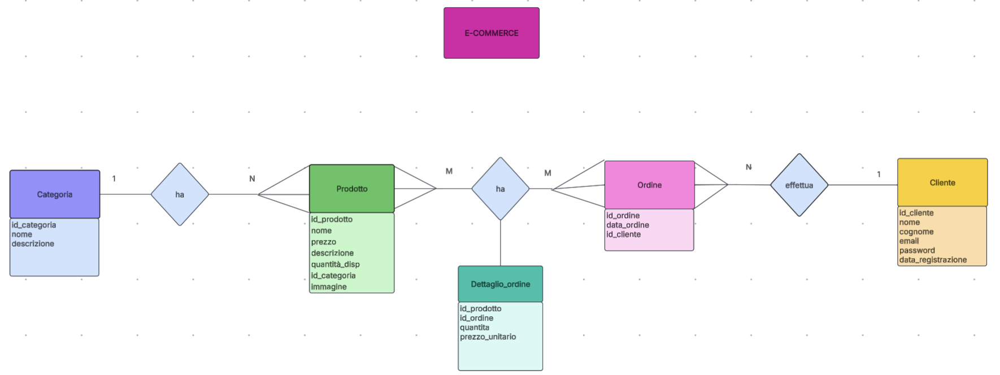
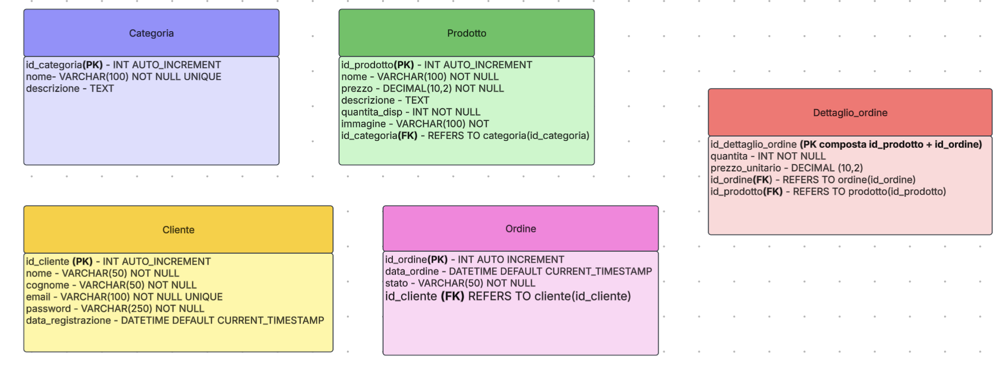

# TechShop E-Commerce

Un'applicazione e-commerce full-stack sviluppata con **Flask (Python)** e **MySQL**. Il progetto è focalizzato su una solida architettura dei dati e una comunicazione efficiente tra client (JavaScript) e server (RESTful).

## 🚀 Tecnologie Utilizzate
* **Backend:** Python, Flask
* **Database:** MySQL (Relazionale)
* **Frontend:** HTML5, CSS3, JavaScript (Fetch API)
* **Design:** Architettura MVC (Model-View-Controller)

## 📊 Progettazione Database (Schema E-R)
La struttura dei dati è stata progettata per garantire la massima coerenza. L'integrazione tra `Prodotti`, `Categorie` e `Ordini` è gestita tramite relazioni normalizzate.

Chiave di lettura:

Un prodotto appartiene a una e una sola categoria, mentre una categoria può contenere uno o più prodotti.

Uno o più prodotti appartengono a uno o più ordini, uno o più ordini appartengono a un prodotto.

Un ordine è effettuato da un solo cliente, mentre un cliente può effettuare uno o più ordini nel tempo.

## 🗄️ Schema Logico (Database Relazionale)
Per implementare il database, lo schema E-R è stato tradotto nel seguente modello relazionale, definendo chiavi primarie (PK) e chiavi esterne (FK):

* **Categoria** (`id_categoria` PK, nome, descrizione)
* **Prodotto** (`id_prodotto` PK, nome, prezzo, descrizione, quantità_disp, `id_categoria` FK, immagine)
* **Ordine** (`id_ordine` PK, data_ordine, `id_cliente` FK)
* **Dettaglio_ordine** (`id_prodotto` FK, `id_ordine` FK, quantità, prezzo_unitario)
* **Cliente** (`id_cliente` PK, nome, cognome, email, password, data_registrazione)

## 💡 Punti di Forza dell'Architettura
* **Data-First Approach:** La progettazione del database è avvenuta in fase preliminare, garantendo integrità referenziale.
* **Gestione Dinamica:** Comunicazione asincrona tra frontend e backend per il carrello senza ricaricare la pagina.
* **Codice Pulito:** Focus sulla leggibilità e sulla manutenibilità, evitando astrazioni superflue.

## 🛠 Funzionalità Implementate
1. **Catalogo Prodotti:** Visualizzazione dinamica filtrata per categoria.
2. **Carrello Persistente:** Utilizzo di `localStorage` per mantenere lo stato del carrello lato client.
3. **Checkout Transazionale:** Invio ordine al database con calcolo totale lato backend.

## 📦 Come avviare il progetto
1. Clona la repository: `git clone ...`
2. Configura il database MySQL con lo script `database_setup.sql`.
3. Installa le dipendenze: `pip install flask flask-sqlalchemy`
4. Avvia il server: `python app.py`